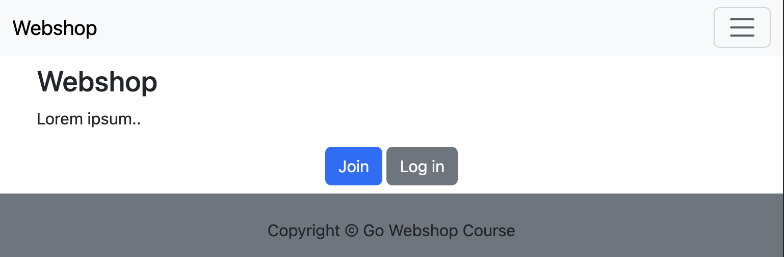

# Step 1: Set up a simple Go web app with HTML.

## Create our project and structure

The name of your project is up to you, for now we will use the course name.

The name of your Go package is also completely up to you. However, it's often just the URL for where you'll
store your project. Even if it's not public.

__1. Create and enter a new directory for your project__
```shell
mkdir go-webshop-course && cd go-webshop-course
```
__2. Let's initiate Go modules__ 
```shell
go mod init github.com/<your username>/go-webshop-course
```
__3. Let's create some directories according to the svc framework__
```shell 
mkdir -p cmd/app handler services storage static
```

_We will not use `services` and `storage` in step 1 yet._

An explanation of these folders is as follows:

- __cmd__: contains executables, most likely just an application (http, grpc), but also CLI tools
- __handler__: contains all files related to handling incoming requests or triggers
- __services__: contains your business logic
- __storage__: contains all repository and storage related operations
- __static__: contains our HTML, CSS, JS and other web related assets

For more information you can read the [README of the svc framework](https://github.com/gerbenjacobs/svc/blob/main/README.md).

## Let's create some files

### cmd/app/main.go

Let's create the main of our application.

```go
func main() {
	http.HandleFunc("/", func(w http.ResponseWriter, r *http.Request) {
		_, _ = w.Write([]byte("Hello World!"))
	})
	_ = http.ListenAndServe(":8000", nil)
}
```

Yep, that's a fully functioning web server in Go.

While you can make it very tiny like that, we know we will create a bigger project than "Hello World http server"
so, let's do some extra fancy stuff already.

- We set up graceful shutdown
  - Create a channel of `os.Signal` so we can listen to termination commands
  - Wait for a signal on that channel, and shut down our `http.Server` with a 5s timeout.
- Create a logger with some nice stdout color output (we'll use `github.com/lmittmann/tint`)
- Create our own `http.Server` struct so can set timeouts (by default there are none)
- Create a little `http.HandleFunc` function for our 'homepage'
- Because `http.ListenAndServe()` is a blocking operation, we put it inside a goroutine
  - We now rely on the `<-shutdown` channel to block our application and keep the HTTP server up
  - This is also why we ignore the `http.ErrServerClosed` error, as this gets triggered by the eventual `srv.Shutdown()`

```go
package main

import (
	"context"
	"errors"
	"log/slog"
	"net/http"
	"os"
	"os/signal"
	"syscall"
	"time"

	"github.com/lmittmann/tint"
)

var address = "localhost:8000"

func main() {
	// handle shutdown signals
	shutdown := make(chan os.Signal, 3)
	signal.Notify(shutdown, syscall.SIGINT, syscall.SIGTERM)

	// create logger
	output := os.Stdout
	tintOpt := &tint.Options{
		Level: slog.LevelDebug,
	}
	logger := slog.New(tint.NewHandler(output, tintOpt))

	// create a handler and server
	homePage := func(w http.ResponseWriter, r *http.Request) {
		logger.DebugContext(r.Context(), "Request received",
			"method", r.Method,
			"url", r.RequestURI,
		)
		_, err := w.Write([]byte("Hello World!"))
		if err != nil {
			logger.Error("failed to write data", "error", err)
		}
	}
	srv := &http.Server{
		Addr:         address,
		ReadTimeout:  5 * time.Second,
		WriteTimeout: 10 * time.Second,
		Handler:      http.HandlerFunc(homePage),
	}

	// start running the server
	go func() {
		logger.Info("Server started", "address", srv.Addr)
		if err := srv.ListenAndServe(); err != nil && !errors.Is(err, http.ErrServerClosed) {
			logger.Error("failed to listen", "error", err)
			os.Exit(1)
		}
	}()

	// wait for shutdown signals
	<-shutdown
	ctx, cancel := context.WithTimeout(context.Background(), 5*time.Second)
	defer cancel()
	if err := srv.Shutdown(ctx); err != nil {
		logger.Error("Server shutdown failed", "error", err)
	}
	logger.Info("Server stopped successfully")
}
```

We can not start our web application and visit `localhost:8000` where we should be greeted by "Hello World!",
with no HTML whatsoever. 

```shell
go run cmd/app/main.go
```

```
Oct 18 16:40:44.445 INF Server started address=localhost:8000
Oct 18 16:43:02.969 DBG Request received method=GET url=/
Oct 18 16:43:03.010 DBG Request received method=GET url=/favicon.ico
```

You can see that your browser is automatically trying to search for `/favicon.ico` as well.

### handler/handler.go

In this file we're going to create our handler struct, this will be the core of our app.

It will implement methods required for serving the HTTP server as well as handling the connection
between frontend routes and the services in our application.

Later on we will use the dependency injection pattern, to hydrate it with whatever is required for our app.

- Create a `Handler` struct
  - Let's give it a `logger *slog.Logger` that we can sent from our main.go
  - To help us with routing, we're going to use an open-source library (`go get github.com/julienschmidt/httprouter`)
  - We can still store this attribute as an interface, if we ever decide to use a different library: `mux http.Handler`
- Now let's create a `New()` method that takes our logger and returns a `*Handler`
  - Create a route for our original homepage: `r.GET("/", h.homePage)`
  - __Task__: Copy the homepage function from our main into this file (and make it a receiver method: `func (h *Handler) homePage()`)
  - We have to update the function signature a little bit: `func (h *Handler) homePage(w http.ResponseWriter, r *http.Request, _ httprouter.Params)`

```go
package handler

import (
	"log/slog"
	"net/http"

	"github.com/julienschmidt/httprouter"
)

// Handler represents our app
// it will have dependencies
// and deal with routing
type Handler struct {
	logger *slog.Logger
	mux    http.Handler
}

func New(logger *slog.Logger) *Handler {
	// create handler and router
	h := new(Handler)
	r := httprouter.New()

	// set logger
	h.logger = logger

	// create routes
	r.GET("/", h.homePage)

	// set mux
	h.mux = r

	return h
}

func (h *Handler) homePage(w http.ResponseWriter, r *http.Request, _ httprouter.Params) {
	// TODO: Get your function from main.go
}
```

Now we go back to `cmd/app/main.go` and remove our `homePage` function.

We then create our app: `app := handler.New(logger)` and pass it the logger.

Replace `http.HandlerFunc(homePage)` with `app` in the `Handler:` attribute. 
Your IDE might now complain that `app`, which is of type `handler.Handler`, 
does not implement the `http.Handler` interface.

Go back to `handler/handler.go` and add the following:

```go
// ServeHTTP makes it so Handler implements the http.Handler interface
func (h *Handler) ServeHTTP(w http.ResponseWriter, r *http.Request) {
	h.mux.ServeHTTP(w, r)
}
```

Our Handler struct now adheres to `http.Handler` and can be directly used in `http.Server`.
We are however passing on the real work to our `httprouter` mux, because it knows our routes.

### static/layout.html

Time to create the main template for our site. We will use a _base layout_ and fill the content from other pages.

We are using Go HTML templating in here: `{{ template "title" . }}` this calls upon the stored template called 'title'.
You can create this template either in Go, or in another file: `{{ define "title" }}Webshop{{ end }}`.

Our `layout.html` requires both a template for `title` as well as `content`.

Looking further we also see some use of `{{ if }}` and  `{{ end }}` statements to close everything.
More about that in step 2.

_To learn more about Go HTML templating see https://gowebexamples.com/templates/ or https://pkg.go.dev/html/template._

You can copy the following, and adjust anything to make it fancy.
We are using Bootstrap (directly loaded from a CDN) to give us some default developer-friendly design.
This also adds responsive breakpoints, our webshop should look good on mobile devices!

```html
<!DOCTYPE html>
<html lang="en">
<head>
  <meta charset="utf-8">
  <meta name="viewport" content="width=device-width, initial-scale=1">
  <title>{{ template "title" . }}</title>

  <meta property="og:title" content='{{ template "title" . }}'>

  <link href="https://cdn.jsdelivr.net/npm/bootstrap@5.3.2/dist/css/bootstrap.min.css" rel="stylesheet"
        integrity="sha384-T3c6CoIi6uLrA9TneNEoa7RxnatzjcDSCmG1MXxSR1GAsXEV/Dwwykc2MPK8M2HN" crossorigin="anonymous">
</head>
<body>

<nav class="navbar navbar-expand-lg bg-body-tertiary">
  <div class="container-fluid">
    <a class="navbar-brand" href="/">
      Webshop
    </a>
    <button class="navbar-toggler" type="button" data-bs-toggle="collapse" data-bs-target="#navbarSupportedContent"
            aria-controls="navbarSupportedContent" aria-expanded="false" aria-label="Toggle navigation">
      <span class="navbar-toggler-icon"></span>
    </button>
    <div class="collapse navbar-collapse" id="navbarSupportedContent">
      <ul class="navbar-nav me-auto mb-2 mb-lg-0">
        <li class="nav-item">
          <a class="nav-link" aria-current="page" href="/">Shop</a>
        </li>
      </ul>
      <ul class="navbar-nav mb-2 mb-lg-0 end-0">
        {{ if .User }}
        <li class="nav-item dropdown">
          <a class="nav-link dropdown-toggle" href="#" role="button" data-bs-toggle="dropdown"
             aria-expanded="false">
            Me
          </a>
          <ul class="dropdown-menu dropdown-menu-end">
            <li><a class="dropdown-item" href="/profile">My profile</a></li>
            <li><a class="dropdown-item" href="/settings">Settings</a></li>
            <li>
              <hr class="dropdown-divider">
            </li>
            <li>
              <form action="/logout" method="post">
                <button type="submit" class="dropdown-item">Log out</button>
              </form>
            </li>
          </ul>
        </li>
        {{ else }}
        <li class="nav-item"><a class="nav-link" href="/login">Log in</a></li>
        <li class="nav-item"><a class="nav-link" href="/signup">Sign up</a></li>
        {{ end }}
      </ul>
    </div>
  </div>
</nav>

<main class="container mt-2">
  {{ template "content" . }}
</main>

<footer class="container-fluid mt-2 bg-secondary">
  <div class="row pt-4 text-center">
    <p>
      Copyright &copy; Go Webshop Course
    </p>
  </div>
</footer>

</body>
</html>
```

### static/homepage.html

Since we're looking for `title` and `content` templates in our `layout.html`, we define them here.

```html
{{ define "title" }}Webshop{{ end }}

{{ define "content" }}
<div class="row padding">
    <div class="col">
        <h2>Webshop</h2>
        <p>
            Lorem ipsum..
        </p>
        <div class="text-center">
            <a href="/login" class="btn btn-primary">Log in</a>
            <a href="/signup" class="btn btn-secondary">Sign up</a>
        </div>
    </div>
</div>
{{ end }}
```

This will be the content for our endpoint on `"/"`.

### handler/handler.go

Time to make some changes in our `homePage()` method. We need to get all our HTML files and render them.

We're going to create a `template.Template` by calling `template.ParseFiles()` on both our
`layout.html` and `homepage.html`. Because we are okay with our application crashing if those files
do not exist, we wrap it in `template.Must()`. 

_Often in Go you might find `MustX()` methods, which are functions which try to do something 
and `panic()` if there are errors. Something that you normally would avoid at all costs._

Then we try to `Execute()` our template on an `io.Writer` interface; oh would you look at that, we have `w http.ResponseWriter`.

```go
func (h *Handler) homePage(w http.ResponseWriter, r *http.Request, _ httprouter.Params) {
	h.logger.DebugContext(r.Context(), "Request received",
		"method", r.Method,
		"url", r.RequestURI,
	)
	tmpl := template.Must(template.ParseFiles(
		"static/layout.html",
		"static/homepage.html",
	))
	if err := tmpl.Execute(w, nil); err != nil {
		h.logger.Error("failed to execute layout", "error", err)
		http.Error(w, "failed to create layout", http.StatusInternalServerError)
		return
	}
}
```

## Run our webshop!

Time to run our final webshop.

```shell
go run cmd/app/main.go
```

.. visit `http://localhost:8000` in our browser.

